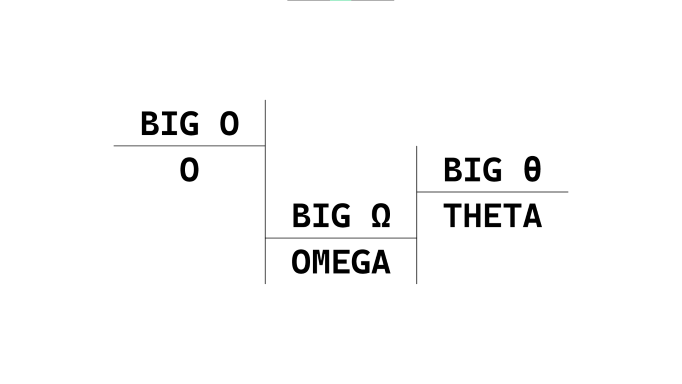

# BigOCheatSheet

* [Pengenalan](#pengenalan)
* [Kompleksitas Komputasi Asimtotik](#kompleksitas-komputasi-asimtotik)
* [Asimtot](#asimtot)
* [Analisis Asimtot](#analisis-asimtot)
* [Big O](#big-o)
* [Big Omega](#big-ω)
* [Big Theta](#big-θ)
* [Perbedaan Ketiganya](#perbedaan-ketiganya)
* [Konteks Kasus Terburuk, Terbaik, Rata-rata](#konteks-kasus-terburuk-terbaik-rata-rata)
* [Referensi](#referensi)

## Pengenalan

Sebelum kita menuju ke situs, kita perlu tahu dahulu apa itu __Kompleksitas Komputasi Asimtotik__. Jika dirimu sudah familiar dengan istilah ini, lewati dan langsung menuju ke [Big-O Cheat Sheet Website](https://www.bigocheatsheet.com/).

**[🔝 kembali ke atas](#bigocheatsheet)**

## Kompleksitas Komputasi Asimtotik

> Dalam teori kompleksitas komputasi, __kompleksitas komputasi asimtotik__ merupakan penggunaan __analisis asimtotik__ untuk _estimasi kompleksitas komputasi algoritma dan masalah komputasi_, yang umumnya dikaitkan dengan penggunaan notasi _big O_. - [Wikipedia](https://en.wikipedia.org/wiki/Asymptotic_computational_complexity)

Untuk memahami istilah-istilah tersebut, kita perlu tahu dahulu apa itu __Asimtot__ sebelum kita menyelam dalam __Analisis Asimtotik__.

**[🔝 kembali ke atas](#bigocheatsheet)**

## Asimtot

> In analytic geometry, an __asymptote__ of a curve is a line such that the distance between the curve and the line approaches zero as one or both of the x or y coordinates tends to infinity. - [Wikipedia](https://en.wikipedia.org/wiki/Asymptote)

Here's a visual example from [jarednielsen](https://jarednielsen.com/static/32c1589243f13448fac04d22cb735af9/40601/desmos-asymptote-01.png)

    y = 1/x

> __No matter how large (or small) the value of x, our curve will never touch the x or y axes__. Even if that number is Infinity. 🐢🏃‍♀️. Especially if that number is zero. Why? It’s mathematically impossible to divide by 0. In the chart above, __the x and y axes__ are the __asymptotes of the equation `y = 1 / x`__. But any line can be an asymptote. We’re not limited to horizontal and vertical lines. - [jarednielsen](https://jarednielsen.com/big-o-omega-theta/)

Now we get the idea of an __asymptote__, let's continue to learn about __Asymptotic Analysis__.

**[🔝 kembali ke atas](#bigocheatsheet)**

## Analisis Asimtot

> In mathematical analysis, __asymptotic analysis__, also known as __asymptotics__, is _a method of describing limiting behavior_. - [Wikipedia](https://en.wikipedia.org/wiki/Asymptotic_analysis)

For example, we get from [jarednielsen](https://jarednielsen.com/big-o-omega-theta/).
Given this function `f(x) = x^2 + 2x` , `x` increases in value (approaches infinity) and `2x` becomes insignificant compared to `x^2`. We then simply say that `f(x)` is __asymptotically__ equivalent to `x^2`

Why do we need this __asymptotic analysis__ you might ask?

Because we need to estimate the computational complexity of algorithms and computational problems. To get everyone on the same page, we use these notations: __big O, big Ω and big θ__ to describe a different type of estimation.

**[🔝 kembali ke atas](#bigocheatsheet)**

## Big O

> __Big O__ describes __the upper bound__ of an algorithm. This is why, for us, as developers and practitioners, we are primarily concerned with Big O. We want to know just how _poorly an algorithm might perform_. - [jarednielsen](https://jarednielsen.com/big-o-omega-theta/)

> It is define as upper bound and __upper bound on an algorithm__ is the most amount of time required (the worst case performance).
__Big O__ notation is used to describe __asymptotic upper bound__. - [GeeksForGeeks](https://www.geeksforgeeks.org/difference-between-big-oh-big-omega-and-big-theta/)

**[🔝 kembali ke atas](#bigocheatsheet)**

## Big Ω

> __Big Omega__ describes __the lower bound__ of an algorithm. If only life always handed us sorted arrays. 🌼. We can also think of this as our _best-case scenario_. - [jarednielsen](https://jarednielsen.com/big-o-omega-theta/)

> It is define as lower bound and __lower bound on an algorithm__ is the least amount of time required (the most efficient way possible, in other words best case).
Just like O notation provide an asymptotic upper bound, __Ω notation__ provides __asymptotic lower bound__. - [GeeksForGeeks](https://www.geeksforgeeks.org/difference-between-big-oh-big-omega-and-big-theta/)

**[🔝 kembali ke atas](#bigocheatsheet)**

## Big θ

> __Big Theta__ describes __the tight bound__ of an algorithm, it’s limit from above and below. Big Theta is often used to describe _the average, or expected_, case for an algorithm. This isn’t exactly true, but it’s a useful shorthand. - [jarednielsen](https://jarednielsen.com/big-o-omega-theta/)

> It is define as tightest bound and __tightest bound__ is the best of all the worst case times that the algorithm can take. - [GeeksForGeeks](https://www.geeksforgeeks.org/difference-between-big-oh-big-omega-and-big-theta/)

**[🔝 kembali ke atas](#bigocheatsheet)**

## Perbedaan Ketiganya

| | Big O | Big Ω / Omega | Big θ / Theta |
| --- | --- | --- | --- |
| Conditional operator-wise | `<=` | `>=` | `==`
| Rate of growth of an algorithm / data structure | is less than | is greater than | is equal to |
| Bound | upper | lower | above and below |
| Notation | `O(n)` | `Ω(n)` | `θ(n)` |

**[🔝 kembali ke atas](#bigocheatsheet)**

## Konteks Kasus Terburuk, Terbaik, Rata-rata

What is the relationship between
> __best case__ / __worst case__ / __expected case__

and

> __Big O__ / __Big Omega (Ω)__ / __Big Theta (θ)__?

__There isn’t one__. 

> Equivalencies are often made between __Big O and worst case__, __Big Omega and best case__, and __Big Theta and average case__, but __we can speak of best, worst, and average__ for __each of these notations__. - [jarednielsen](https://jarednielsen.com/big-o-omega-theta/)

> For example, each of the following statements about __worst case__ are true:
>> Insertion Sort’s worst case rate of growth is __at most__ `O(n^2)`  
>> Insertion Sort’s worst case rate of growth is __at least__ `Ω(n)`  
>> Insertion Sort’s worst case rate of growth is __exactly__ `Θ(n^2)`

**[🔝 kembali ke atas](#bigocheatsheet)**

## Referensi

[Big-O Cheat Sheet Website](https://www.bigocheatsheet.com/) ◽ last accessed 6 September 2022

[Asymptotic computational complexity](https://en.wikipedia.org/wiki/Asymptotic_computational_complexity) ◽ last accessed 6 September 2022

[Asymptote](https://en.wikipedia.org/wiki/Asymptote) ◽ last accessed 6 September 2022

[Asymptotic analysis](https://en.wikipedia.org/wiki/Asymptotic_analysis) ◽ last accessed 6 September 2022

[What’s the Difference Between Big O, Big Omega, and Big Theta?](https://jarednielsen.com/big-o-omega-theta/) ◽ last accessed 6 September 2022

[Difference between Big Oh, Big Omega and Big Theta](https://www.geeksforgeeks.org/difference-between-big-oh-big-omega-and-big-theta/) ◽ last accessed 6 September 2022

**[🔝 kembali ke atas](#bigocheatsheet)**